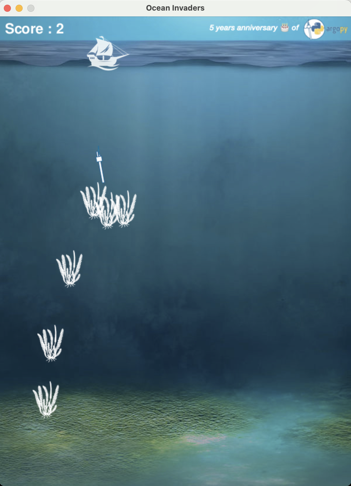

# Ocean invaders

A pygame implementation of the famous Space Invaders adapted to Argo floats

# How to

Install the conda environment (all it requires is py 3.10 and [pygame](https://www.pygame.org/))
```bash
mamba env create --file py3.10-all-pinned.yml
```

then execute program:
```bash
python ocean_invaders.py
```

- Use right/left arrows to move the deployment boat
- Use space bar to deploy an Argo float

You cannot deploy a new float before the previous one has hit a target or reach the ocean bottom

The goal is to hit all algas before they reach the surface 

You should see a new window like this one:


